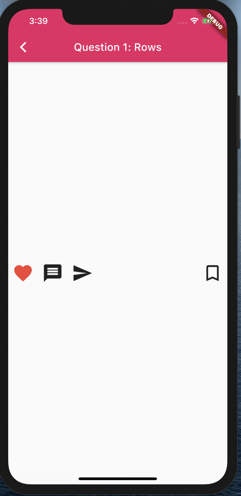
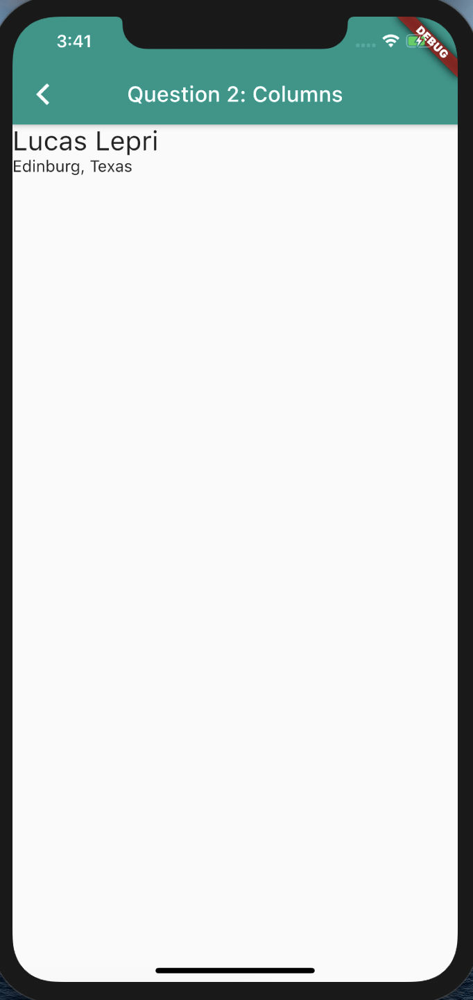
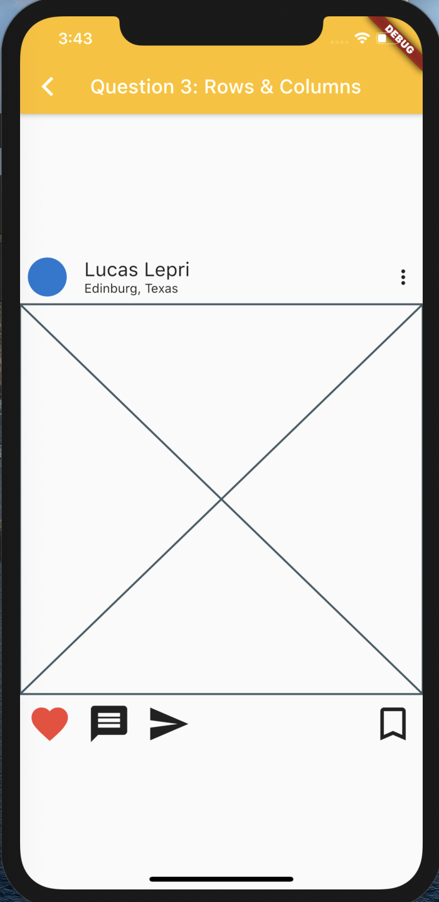

# Homework 3 - Flutter Layout

The objective of this homework assignment is for you to learn how to arrange your widgets using Layout Widgets **Column**, **Row**, **Spacer**, and **Listview**. For each question you will need to lay out widgets so they match the screenshots provided.

All your modifications/changes will go under:
`lib/questions/`

You will change the question#.dart files.

The starting point for the whole application is: 
`lib/main.dart`

## Question 1: Rows

I have provided the Row widget, you just need to add the widgets so they match the screenshot.

**Hint**: You will need to use the [Spacer](https://api.flutter.dev/flutter/widgets/Spacer-class.html) widget.



## Question 2: Columns

I have provided the Column widget, you just need to add the widgets so they match the screenshot.

**Note**: The following snippet makes the children of a Column start to the left.
```dart
    crossAxisAlignment: CrossAxisAlignment.start
```




## Question 3: Rows & Columns

For this question, you will need to use the widgets created in **Question 1** and **Question 2**. I have provided the outer Column widget for you.

**Hint**: Lookup [CircleAvatar](https://api.flutter.dev/flutter/material/CircleAvatar-class.html) and [Placeholder](https://api.flutter.dev/flutter/widgets/Placeholder-class.html) widgets.




## Question 4: ListView

For this question, you will be copying over the widgets from **Question 3** and putting them inside a [ListView](https://api.flutter.dev/flutter/widgets/ListView-class.html) provided. Add at least 3 posts to the ListView.

**Note**: For this question the content of each post is up to you. Replace the placeholder widget with an image.


<br>

## Grading Criteria

| Task | Value of each task | Possible Points Lost |
|---|---|---|
| Question 1: Rows | 20 points | If there is no space between the send icon and bookmark_outline widget, then there’s no credit given. |
| Question 2:  Columns | 20 points | If the column content is not aligned to the top-left, then there’s no credit given. |
| Question 3:  Rows & Columns | 25 points | If the screen doesn’t match the screenshot. (-10 pts top row doesn’t match) (-5 pts image is misplaced or missing) (-10 pts bottom row doesn’t match) |
| Question 4:  ListView | 35 points | If the screen is not scrollable. (-20 pts screen is not scrollable) (-15 pts doesn’t match the GIF)  |
| | 100 points total | |
